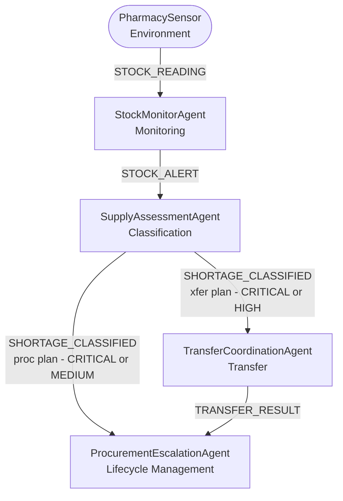

# MedStock — Acquaintance Diagram
**Prometheus Methodology Artifact**
Student ID: 11126586 | Course: DCIT 403

> An acquaintance diagram shows which agents communicate with which other agents.
> Arrows indicate the direction of message flow. The PharmacySensor is an environment object (not an agent) but is included as the source of percepts.

---

## Coupling Analysis

| Agent Pair | Message | Direction |
|---|---|---|
| PharmacySensor → StockMonitorAgent | STOCK_READING | 1-to-1 |
| StockMonitorAgent → SupplyAssessmentAgent | STOCK_ALERT | 1-to-1 |
| SupplyAssessmentAgent → TransferCoordinationAgent | SHORTAGE_CLASSIFIED | 1-to-1 |
| SupplyAssessmentAgent → ProcurementEscalationAgent | SHORTAGE_CLASSIFIED | 1-to-1 |
| TransferCoordinationAgent → ProcurementEscalationAgent | TRANSFER_RESULT | 1-to-1 |

> No agent sends a message back to a higher-level agent. The only lateral message is TRANSFER_RESULT from TransferCoordinationAgent to ProcurementEscalationAgent, which are at the same architectural level.

---

## Agent Responsibilities Summary

| Agent | Knows About | Talks To |
|---|---|---|
| StockMonitorAgent | DrugDatabase (reads and writes stock levels) | SupplyAssessmentAgent |
| SupplyAssessmentAgent | DrugDatabase (reads drug category) | TransferCoordinationAgent, ProcurementEscalationAgent |
| TransferCoordinationAgent | DrugDatabase (reads all ward stocks, writes after transfer); WardDatabase (writes TransferRecords) | ProcurementEscalationAgent |
| ProcurementEscalationAgent | SupplierDatabase (reads suppliers, writes ProcurementRecords) | None — terminal agent |