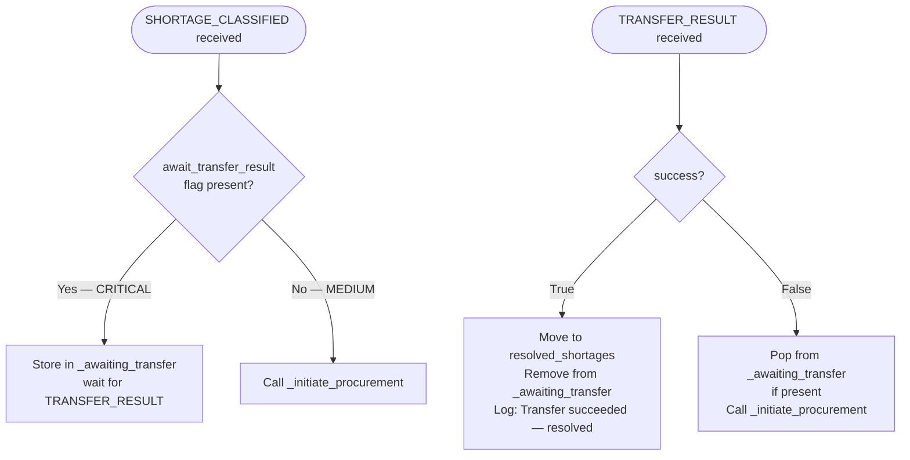
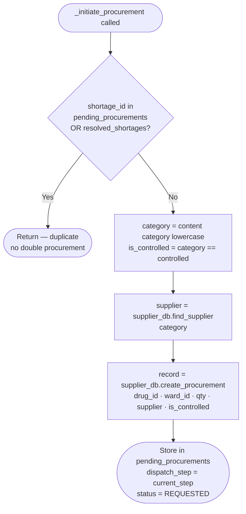
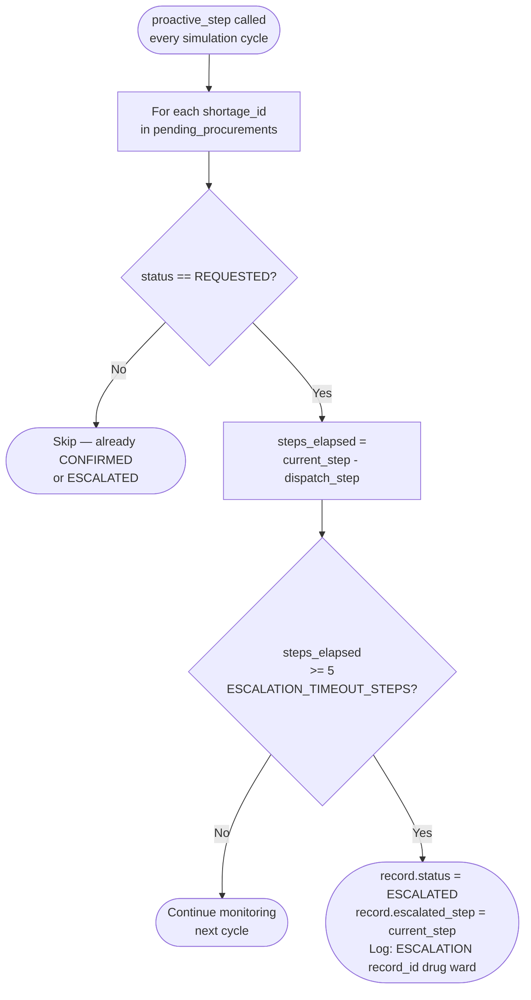
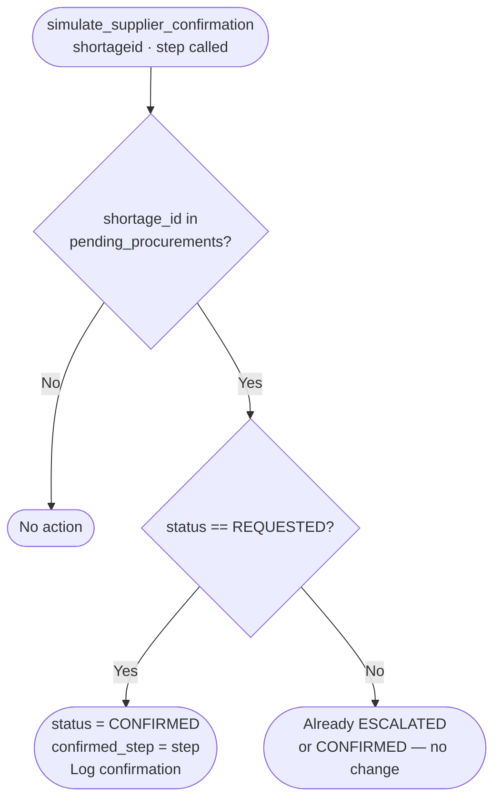

# MedStock — Capability Overview: ProcurementEscalationAgent
**Prometheus Methodology Artifact**
Student ID: 11126586 | Course: DCIT 403

**Agent:** ProcurementEscalationAgent
**Role:** Terminal agent in the pipeline. Manages the full procurement lifecycle: initiation, tracking, proactive escalation, and supplier confirmation.

---

## Capability 1 & 2: Handle Incoming Messages

---

## Capability 3: InitiateProcurement — Internal Plan

---

## Capability 4: ProactiveEscalation — Runs Every Cycle

---

## Capability 5: ConfirmSupply — External Trigger

---

## Escalation Timeline Example — Morphine SURGICAL

| Step | elapsed = current − dispatch | Outcome |
|---|---|---|
| 3 | 0 | PR-001 created (dispatch_step=3) |
| 4 | 1 < 5 | No escalation |
| 5 | 2 < 5 | No escalation |
| 6 | 3 < 5 | No escalation |
| 7 | 4 < 5 | No escalation |
| 8 | **5 ≥ 5** | **PR-001 → ESCALATED** |

---

## Percepts, Beliefs, Actions

| Type | Detail |
|---|---|
| **Percepts** | SHORTAGE_CLASSIFIED (from SupplyAssessment); TRANSFER_RESULT (from TransferCoord); simulate_supplier_confirmation() (from Simulator at step 14) |
| **Belief: SupplierDatabase** | find_supplier(category) → Supplier; create_procurement → ProcurementRecord; get_all_procurements |
| **Belief: pending_procurements** | dict[shortage_id → tracking dict] — dispatch_step, status, record |
| **Belief: resolved_shortages** | dict[shortage_id → resolution info] |
| **Belief: _awaiting_transfer** | dict[shortage_id → shortage_info] — holds CRITICAL cases waiting for transfer result |
| **Action** | supplier_db.create_procurement() — create ProcurementRecord (PR-001 format) |
| **Action** | Update record.status to ESCALATED or CONFIRMED |
| **Action** | Log escalation and confirmation events via log_callback |
