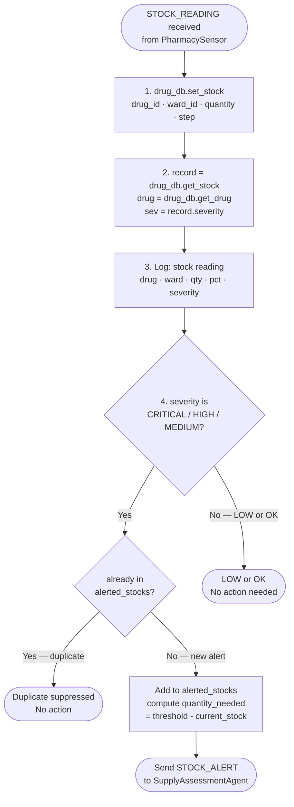
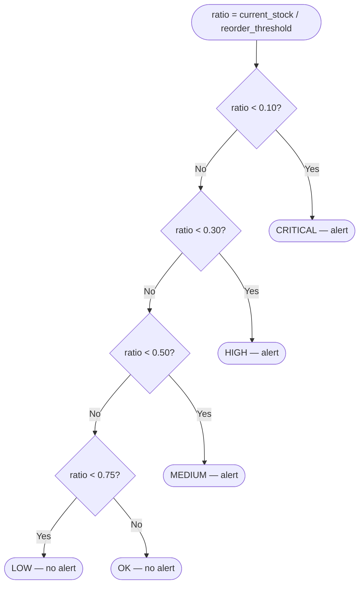

# MedStock — Capability Overview: StockMonitorAgent
**Prometheus Methodology Artifact**
Student ID: 11126586 | Course: DCIT 403

**Agent:** StockMonitorAgent
**Role:** First-level reactive monitoring agent. Receives all sensor data.

---

## Capability: MonitorStock — Plan Flow

---

## Severity Logic — StockRecord.severity()

---

## Percepts, Beliefs, Actions

| Type | Detail |
|---|---|
| **Percept** | STOCK_READING — drug_id, ward_id, quantity, step — from PharmacySensor |
| **Belief: DrugDatabase** | drugs: dict[drug_id → Drug]; stocks: dict[(drug_id, ward_id) → StockRecord] |
| **Belief: alerted_stocks** | set of (drug_id, ward_id) tuples — duplicate suppression |
| **Action: set_stock()** | Update DrugDatabase with sensor-reported quantity |
| **Action: send STOCK_ALERT** | Notify SupplyAssessmentAgent of detected shortage |

### STOCK_ALERT Content
`drug_id · ward_id · current_stock · reorder_threshold · severity · quantity_needed · step`
