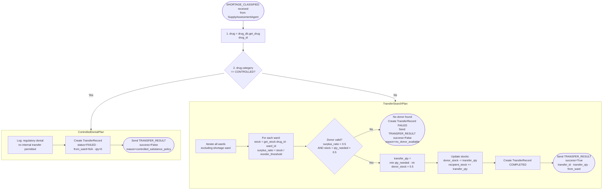

# MedStock — Capability Overview: TransferCoordinationAgent
**Prometheus Methodology Artifact**
Student ID: 11126586 | Course: DCIT 403

**Agent:** TransferCoordinationAgent
**Role:** Inter-ward transfer agent. Enforces controlled substance policy. Searches for surplus donor wards and executes stock transfers.

---

## Capability: CoordinateTransfer — Plan Flow

---

## Percepts, Beliefs, Actions

| Type | Detail |
|---|---|
| **Percept** | SHORTAGE_CLASSIFIED — shortage_id, drug_id, drug_name, ward_id, severity, category, current_stock, reorder_threshold, quantity_needed, step |
| **Belief: DrugDatabase** | get_drug, get_stock, set_stock — reads all ward stocks, writes both donor and recipient after transfer |
| **Belief: WardDatabase** | get_all_wards → list of Ward; create_transfer → TransferRecord |
| **Action: set_stock()** | Update stock levels for both donor and recipient wards |
| **Action: create_transfer()** | Write TransferRecord (TR-001 format) with COMPLETED or FAILED status |
| **Action: send TRANSFER_RESULT** | Notify ProcurementEscalationAgent of outcome |

### TRANSFER_RESULT Content
**On success:** `shortage_id · drug_id · drug_name · ward_id · success=True · severity · category · quantity_needed · step · transfer_id · transfer_qty · from_ward`

**On failure:** `shortage_id · drug_id · drug_name · ward_id · success=False · reason · severity · category · quantity_needed · step`
