# MedStock — Goal Hierarchy Diagram
**Prometheus Methodology Artifact**
Student ID: 11126586 | Course: DCIT 403

```mermaid
graph TD
    TLG([TOP-LEVEL GOAL\nEnsure continuous availability of\ncritical pharmaceutical supplies\nacross all hospital wards])

    TLG --> G1
    TLG --> G2
    TLG --> G3
    TLG --> G4
    TLG --> G5

    G1[G1: Monitor drug stock\nlevels across all wards]
    G1 --> G11[G1.1: Receive stock readings\nfrom the pharmacy sensor network]
    G1 --> G12[G1.2: Compute stock level as a\npercentage of reorder threshold]
    G1 --> G13[G1.3: Classify severity\nCRITICAL / HIGH / MEDIUM / LOW / OK]
    G1 --> G14[G1.4: Suppress duplicate alerts\nfor already-alerted stock-ward pairs]

    G2[G2: Classify shortages by\nclinical priority and regulatory context]
    G2 --> G21[G2.1: Map shortage to drug category\nCONTROLLED / ESSENTIAL / STANDARD]
    G2 --> G22[G2.2: Select response plan\nbased on severity level]
    G2 --> G23[G2.3: Prevent duplicate\nclassification of the same shortage]
    G2 --> G24[G2.4: Maintain full metadata\nfor all active shortages]

    G3[G3: Coordinate internal ward transfers\nfor non-controlled drugs]
    G3 --> G31[G3.1: Search all wards for\na donor with surplus stock]
    G3 --> G32[G3.2: Calculate safe transfer quantity\nmax 50 percent of donor stock]
    G3 --> G33[G3.3: Update both donor and\nrecipient stock levels after transfer]
    G3 --> G34[G3.4: Record all transfer attempts\nwith full audit trail]
    G3 --> G35[G3.5: Enforce controlled substance policy\nno internal transfer of CONTROLLED drugs]

    G4[G4: Initiate emergency procurement\nfrom approved suppliers]
    G4 --> G41[G4.1: Select supplier by drug\ncategory from supplier registry]
    G4 --> G42[G4.2: Create procurement record with\ndrug, ward, and quantity details]
    G4 --> G43[G4.3: Track procurement status\nREQUESTED / CONFIRMED / ESCALATED]
    G4 --> G44[G4.4: Await and process\nsupplier confirmation events]

    G5[G5: Escalate overdue\nprocurement orders]
    G5 --> G51[G5.1: Proactively check elapsed steps\nfor all pending orders every cycle]
    G5 --> G52[G5.2: Escalate procurement when\ntimeout of 5 steps is exceeded]
    G5 --> G53[G5.3: Update procurement record status\nand log the escalation event]
```

---

## Severity Thresholds

| Severity | Condition | Action |
|---|---|---|
| CRITICAL | stock / threshold < 10% | G2.2 selects CRITICAL plan |
| HIGH | stock / threshold < 30% | G2.2 selects HIGH plan |
| MEDIUM | stock / threshold < 50% | G2.2 selects MEDIUM plan |
| LOW | stock / threshold < 75% | No alert — monitoring only |
| OK | stock / threshold ≥ 75% | No alert |

## Plan Selection (G2.2)

| Severity | Recipients | Flag |
|---|---|---|
| CRITICAL | TransferCoordinationAgent AND ProcurementEscalationAgent | await_transfer_result = True on procurement message |
| HIGH | TransferCoordinationAgent only | transfer-first policy |
| MEDIUM | ProcurementEscalationAgent only | direct procurement watch |