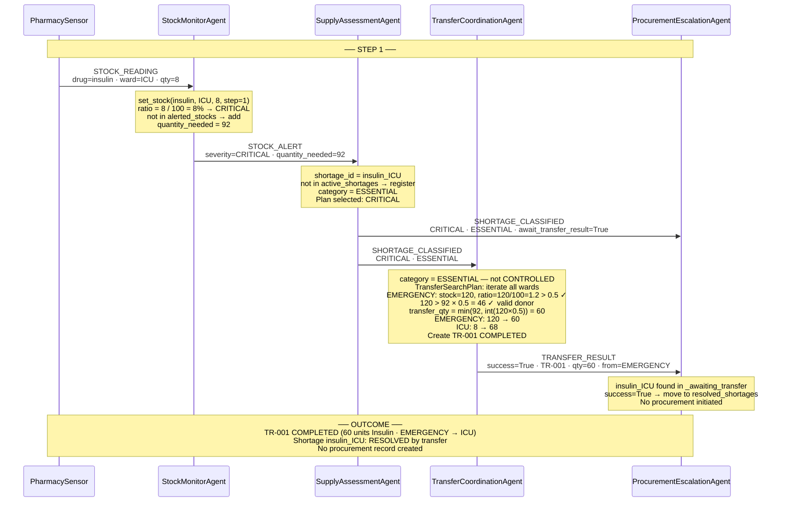

# MedStock — Interaction Diagram: Scenario 1
**Insulin ICU Critical Shortage — Transfer Success**
Student ID: 11126586 | Course: DCIT 403

> **Scenario:** At step 1, the ICU ward has only 8 units of Insulin (8% of threshold).
> The system detects the CRITICAL shortage, finds surplus in EMERGENCY (120 units),
> and transfers 60 units. No procurement is needed.

