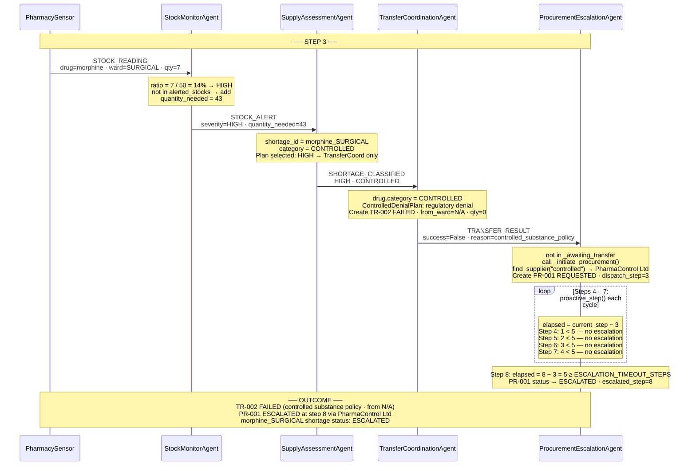

# MedStock — Interaction Diagram: Scenario 2
**Morphine SURGICAL — Controlled Substance Policy + Escalation**
Student ID: 11126586 | Course: DCIT 403

> **Scenario:** At step 3, SURGICAL has 7 mg of Morphine (14% of threshold = HIGH severity).
> Morphine is CONTROLLED. Internal transfer is denied by regulatory policy.
> Procurement PR-001 is created at step 3. No confirmation arrives.
> Escalation occurs at step 8 (5 steps after dispatch).

