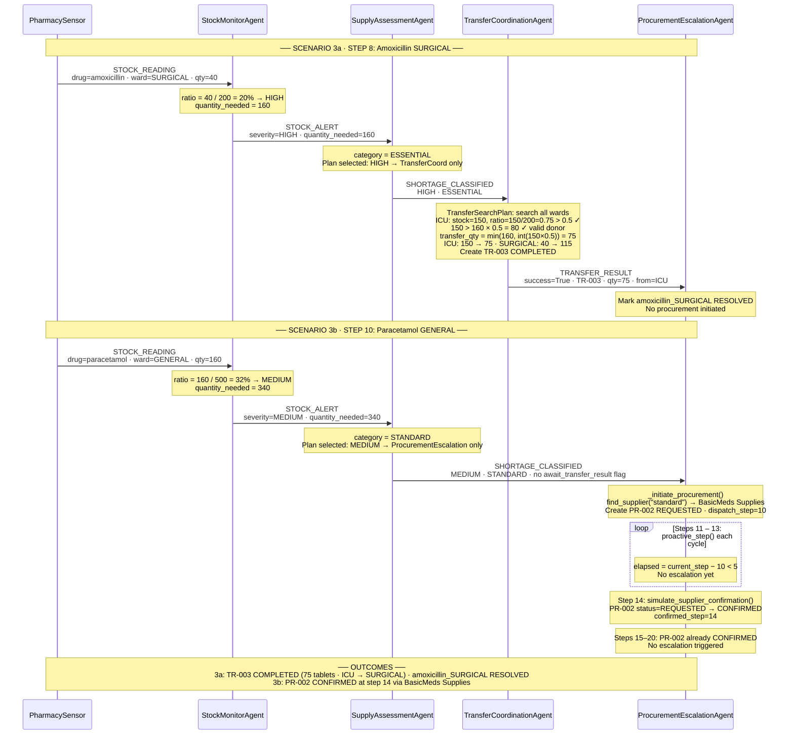

# MedStock — Interaction Diagram: Scenario 3
**Amoxicillin SURGICAL (Transfer) + Paracetamol GENERAL (Procurement Confirmed)**
Student ID: 11126586 | Course: DCIT 403

> **Scenario 3a:** Step 8 — Amoxicillin SURGICAL (40 tablets, 20% = HIGH). Transfer from ICU (150 tablets) succeeds.
>
> **Scenario 3b:** Step 10 — Paracetamol GENERAL (160 tablets, 32% = MEDIUM). Procurement PR-002 via BasicMeds, confirmed at step 14.

