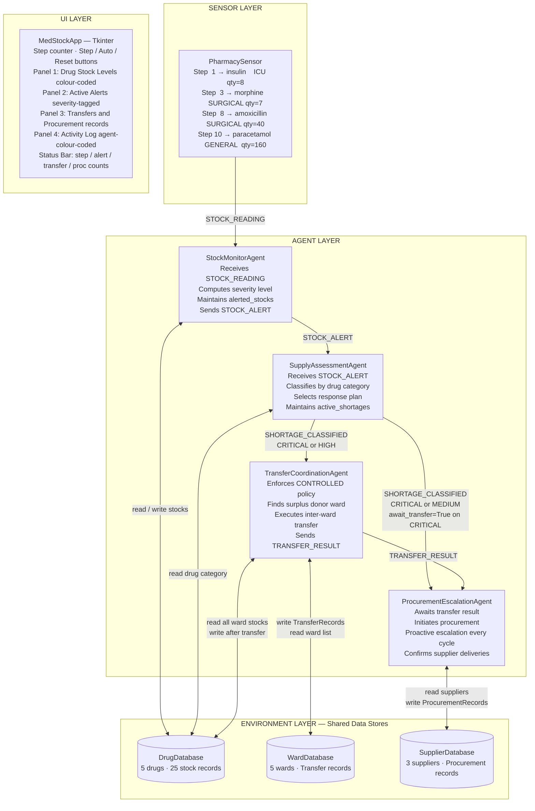

# MedStock — System Overview Diagram
**Prometheus Methodology Artifact**
Student ID: 11126586 | Course: DCIT 403

---

## Key Constants

| Constant | Value | Purpose |
|---|---|---|
| ESCALATION_TIMEOUT_STEPS | 5 | Steps without confirmation before escalation |
| SENSOR_SCHEDULE | Steps 1, 3, 8, 10 | Pre-scheduled PharmacySensor events |
| SUPPLIER_CONFIRMATION | Step 14 | paracetamol_GENERAL confirmation injection |
| TOTAL_STEPS | 20 | Simulation duration |

---

## Drugs and Wards

| Drug | Category | Threshold |
|---|---|---|
| Insulin | ESSENTIAL | 100 units |
| Morphine | CONTROLLED | 50 mg |
| Amoxicillin | ESSENTIAL | 200 tablets |
| Paracetamol | STANDARD | 500 tablets |
| IV Fluids | ESSENTIAL | 300 units |

| Ward | Priority |
|---|---|
| ICU | 5 (highest) |
| Emergency | 4 |
| Surgical | 3 |
| Maternity | 2 |
| General | 1 |